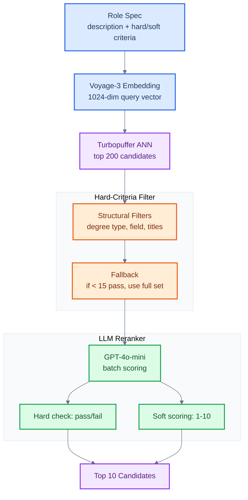

# Candidate Search Pipeline


Three-stage retrieval pipeline for matching candidates to role specifications: vector retrieval, hard-criteria filtering, and LLM reranking. Evaluated across 10 distinct role configurations spanning law, medicine, engineering, finance, and academia.

## The Problem

You have a vector database of candidate profiles and a role spec with both hard requirements (JD degree, 3+ years experience) and soft preferences (IRS audit exposure, legal writing). Embedding similarity alone conflates these, returning candidates who are semantically close but missing hard requirements entirely.

## What This Does

1. **Vector retrieval**: Embed a rich query (description + hard + soft criteria) with Voyage-3, retrieve top 200 from Turbopuffer via ANN search
2. **Hard-criteria filtering**: Regex-based structural filters on degree type, field of study, and experience titles. Intentionally relaxed to preserve recall, with a fallback to the full candidate set if fewer than 15 pass
3. **LLM reranking**: GPT-4o-mini scores each candidate on hard + soft criteria. Hard failures get score 0. Remaining candidates scored 1-10 on soft criteria fit

## Architecture



## Quick Start

**Prerequisites**: Python 3.9+, API keys for OpenAI, Voyage AI, and Turbopuffer.

```bash
python -m venv venv && source venv/bin/activate
pip install -r requirements.txt

export OPENAI_API_KEY="sk-..."
export VOYAGE_API_KEY="pa-..."
export TPUF_API_KEY="tpuf_..."

python main.py                              # Run all 10 configs
python main.py --config tax_lawyer.yml      # Run single config
python main.py --no-submit                  # Run without submitting to eval endpoint
```

## Results

| Config | Avg Score |
|---|---|
| Mechanical Engineers | 92.7 |
| Bankers | 81.3 |
| Tax Lawyer | 80.0 |
| Junior Corporate Lawyer | 74.3 |
| Radiology | 71.0 |
| Mathematics PhD | 42.5 |
| Biology Expert | 37.7 |
| Quantitative Finance | 34.0 |
| Doctors (MD) | 8.0 |
| Anthropology | 0.0 |

Scores are averaged across hard and soft criteria evaluations. Configs with clear structural signals (engineering degrees, JD + bar) perform best. Configs requiring nuanced recency or subfield matching (anthropology, quantitative finance) expose the limits of relaxed filtering combined with summary-only LLM context.

## Design Decisions

**Rich query embedding.** Rather than embedding only the role description, the query concatenates description, hard criteria, and soft criteria. This biases retrieval toward candidates matching the full spec rather than just topical similarity.

**Relaxed hard filters.** Filters are intentionally loose (e.g., matching "doctor" OR "phd" for medical roles). The LLM reranker handles nuanced distinctions like "top school" or recency. If a filter is too aggressive (< 15 candidates), it falls back to the unfiltered set.

**Batched LLM reranking.** Candidates are scored in batches of 5 to stay within context limits while providing enough comparison context for relative scoring.

## Project Structure

```
mercor-search/
├── main.py              # Entry point: run all/single configs, submit results
├── pipeline.py          # 3-stage orchestration: embed, filter, rerank
├── embed.py             # Voyage-3 query embedding
├── tpuf_client.py       # Turbopuffer vector search client
├── filters.py           # Per-config hard-criteria filters
├── rerank.py            # GPT-4o-mini batch reranking
├── evaluate.py          # Mercor eval endpoint submission
├── configs/
│   └── queries.json     # 10 role configurations
├── results/             # Per-config evaluation results
└── requirements.txt
```

## Limitations

- **Filter granularity.** Hard filters operate on degree type and title keywords only. Candidates with non-standard titles or education formats may be incorrectly filtered.
- **LLM context.** Reranking uses truncated summaries (600 chars). Full profile context would improve scoring for ambiguous cases.
- **Single embedding model.** Voyage-3 only. Comparing against OpenAI, Cohere, or BGE embeddings would test retrieval sensitivity.
- **No iterative refinement.** Each config runs once. Feeding eval results back to adjust filter thresholds or reranking prompts would improve low-scoring configs.

## License

MIT
