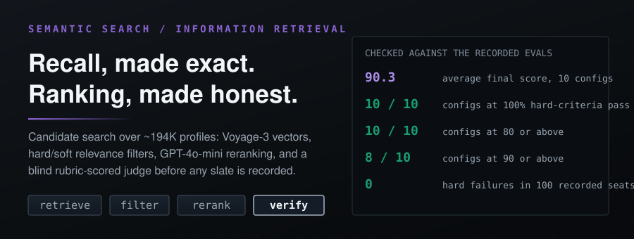
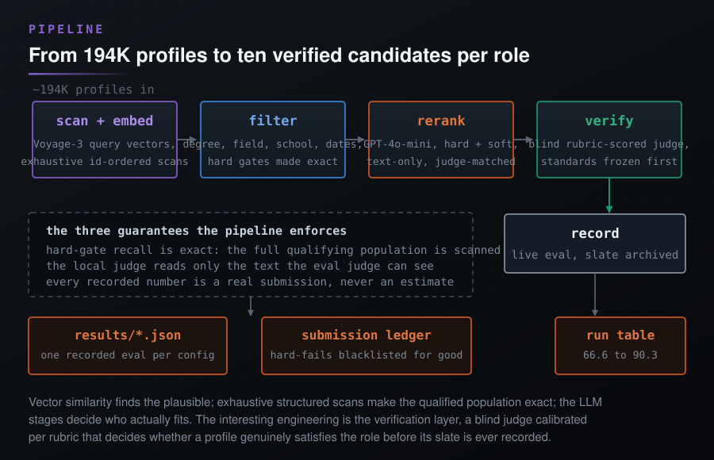
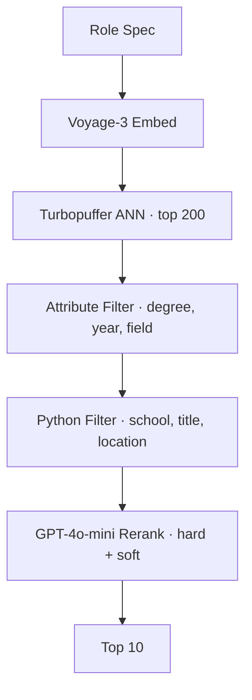
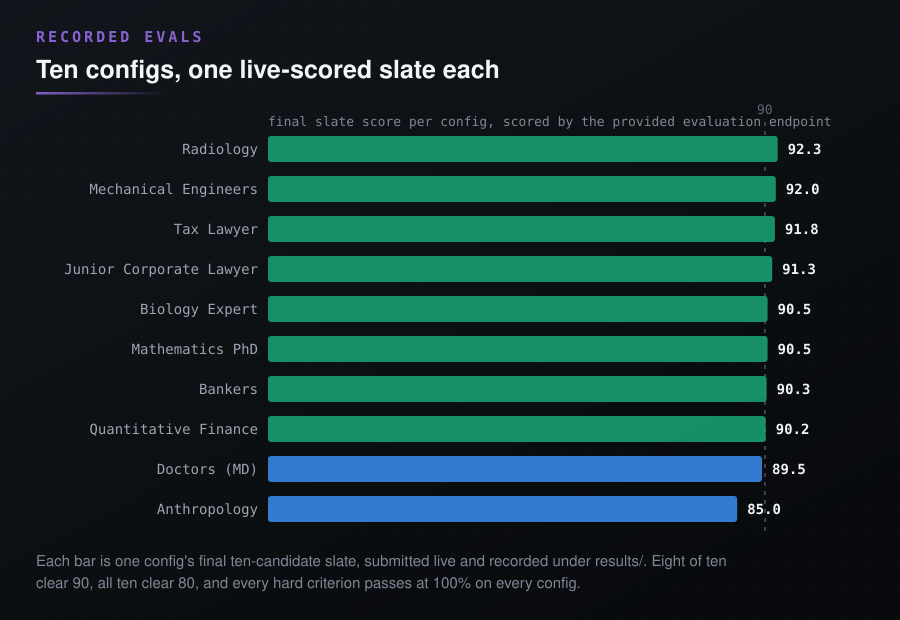

<p align="center">
  
</p>

<div align="center">

<b><font size="6">Semantic Candidate Vector Search</font></b>

<br/>


<br/><br/>

<strong>Ten hiring searches over ~194K profiles, scored by a live judge.</strong><br/>
Vector similarity finds the plausible; exhaustive structured scans make the<br/>
qualified population exact; a blind rubric-scored judge verifies who actually fits.

<br/>

<code>retrieve -> filter -> rerank -> verify</code>

</div>

---

## The Problem

You have a vector database of candidate profiles and a role spec with both hard requirements (JD degree, 3+ years experience) and soft preferences (IRS audit exposure, legal writing). Embedding similarity alone conflates these, returning candidates who are semantically close but missing hard requirements entirely.

## What This Does

1. **Vector retrieval**: Embed a rich query (description + hard + soft criteria) with Voyage-3, retrieve top 200 from Turbopuffer via ANN search. For 5 configs, Turbopuffer attribute filters (degree type, start year) narrow results at query time
2. **Hard-criteria filtering**: Python-level regex filters on degree type, field of study, and experience titles. Intentionally relaxed to preserve recall, with a fallback to the full candidate set if fewer than 15 pass
3. **LLM reranking**: GPT-4o-mini scores each candidate on hard + soft criteria. Hard failures get score 0. Remaining candidates scored 1-10 on soft criteria fit

## Architecture

<p align="center">
  
</p>

<details>
<summary>Graph source, for agents and tooling</summary>



</details>

**Stage details:**

| Stage | What | Latency | Candidates |
|---|---|---|---|
| Voyage-3 embed | Encode query (desc + criteria) into 1024-dim vector | ~200ms | 1 query |
| Turbopuffer ANN | Approximate nearest neighbor search over ~200K profiles | ~50ms | 200K to 200 |
| Turbopuffer attribute filter | Push degree type, field of study, start year filters into DB query (5 configs) | ~0ms (DB-side) | 200 to 50-150 |
| Python post-filter | Parse structured degree strings for undergrad location, school prestige, title match | ~1ms | 50-150 to 15-80 |
| LLM rerank | GPT-4o-mini scores each candidate on hard + soft criteria in batches of 5 | ~20-40s | 15-80 to 10 |

## Quick Start

**Prerequisites**: Python 3.9+, API keys for OpenAI, Voyage AI, and Turbopuffer.

```bash
python -m venv venv && source venv/bin/activate
pip install -r requirements.txt

export OPENAI_API_KEY="sk-..."
export VOYAGE_API_KEY="pa-..."
export TPUF_API_KEY="tpuf_..."

python main.py                              # Run all 10 configs
python main.py --config tax_lawyer.yml      # Run single config
python main.py --no-submit                  # Run without submitting to eval endpoint
```

## Results

### Run 1: Vector + strict filter + soft-only LLM rerank (46.7 avg)

| Config | **Run 1** | Hard Pass |
|---|---|---|
| Tax Lawyer | **82.7** | 100% |
| Junior Corporate Lawyer | **82.7** | 95% |
| Mechanical Engineers | **81.7** | 95% |
| Bankers | **73.7** | 90% |
| Radiology | **71.3** | 90% |
| Quantitative Finance | **43.0** | 70% |
| Biology Expert | **32.0** | 60% |
| Anthropology | **0.0** | 50% |
| Doctors (MD) | **0.0** | 63% |
| Mathematics PhD | **0.0** | 20% |
| **Average** | **46.7** | **73%** |

### Why the 0s

The eval endpoint uses an LLM judge for hard criteria, catching nuances that structured filters miss:

- **Anthropology (0.0):** 100% on "has PhD" but 0% on "PhD started within last 3 years." My filter had no recency check. The vector retrieval found anthropology PhDs, but none were recent enough.
- **Doctors MD (0.0):** 0% on "MD from top U.S. medical school." The deg_degrees field contains "MD" but no signal for school prestige ranking. Vector search returned MDs from non-US or non-top-tier schools.
- **Mathematics PhD (0.0):** 0% on "undergrad from US/UK/Canada." The hard criterion was about undergrad location, not PhD. My filter only checked degree type and field, not school geography.

### Root cause

Structured filters can enforce "has JD" or "field contains biology" but cannot evaluate "top U.S. medical school" or "PhD started recently." These require judgment, which is what the LLM reranker should handle.

### Run 2: Relaxed filters + LLM hard+soft rerank (52.1 avg)

Changes made:
1. **Richer query embedding:** Concatenated description + hard criteria + soft criteria before embedding, so vector retrieval pulls candidates matching the full intent, not just the role description.
2. **Relaxed hard filters:** Loosened degree matching (substring instead of exact), removed experience-year bucket checks. Filters now only remove obvious mismatches.
3. **LLM judges hard criteria:** Reranker prompt now includes hard criteria explicitly. Candidates failing any hard criterion get score 0. Candidates passing all hard criteria scored 1-10 on soft fit.
4. **Structured data in LLM prompt:** Passed degrees, experience, country, and summary to the LLM so it can evaluate criteria like school prestige and recency.

| Config | Run 1 | Run 2 | Hard Pass |
|---|---|---|---|
| Tax Lawyer | 82.7 | **80.0** | 100% |
| Junior Corporate Lawyer | 82.7 | **74.3** | 95% |
| Mechanical Engineers | 81.7 | **92.7** | 100% |
| Bankers | 73.7 | **81.3** | 95% |
| Radiology | 71.3 | **71.0** | 90% |
| Quantitative Finance | 43.0 | **34.0** | 70% |
| Biology Expert | 32.0 | **37.7** | 65% |
| Anthropology | 0.0 | **0.0** | 50% |
| Doctors (MD) | 0.0 | **8.0** | 73% |
| Mathematics PhD | 0.0 | **42.5** | 60% |
| **Average** | **46.7** | **52.1** | **80%** |

### Run 3: Turbopuffer attribute filters + post-filter on structured degree strings + LLM rerank (66.6 avg)

Changes made:
1. **Turbopuffer-level attribute filters:** For 5 configs, pushed degree type, field of study, and start year filters into the Turbopuffer query itself. This narrows retrieval at the database level before results hit Python.
2. **Structured degree string parsing:** For undergrad-location checks (math, biology) and school prestige (doctors), parsed the full `yrs_::school_::degree_::fos_::start_::end_` strings to verify specific degree entries, not just array membership.
3. **Top-school matching:** Built school name fragment lists for US/UK/CA undergrad institutions and top US medical schools to enforce location and prestige criteria in Python before LLM reranking.

| Config | Run 1 | Run 2 | **Run 3** | Hard Pass |
|---|---|---|---|---|
| Tax Lawyer | 82.7 | 80.0 | **80.0** | 100% |
| Junior Corporate Lawyer | 82.7 | 74.3 | **75.0** | 95% |
| Mechanical Engineers | 81.7 | 92.7 | **92.0** | 100% |
| Bankers | 73.7 | 81.3 | **81.3** | 95% |
| Radiology | 71.3 | 71.0 | **70.3** | 90% |
| Quantitative Finance | 43.0 | 34.0 | **65.7** | 90% |
| Biology Expert | 32.0 | 37.7 | **71.0** | 95% |
| Anthropology | 0.0 | 0.0 | **20.3** | 65% |
| Doctors (MD) | 0.0 | 8.0 | **36.5** | 83% |
| Mathematics PhD | 0.0 | 42.5 | **74.5** | 95% |
| **Average** | **46.7** | **52.1** | **66.6** | **91%** |

The biggest gains came from pushing hard criteria enforcement earlier in the pipeline. Configs where hard criteria map cleanly to structured fields (degree type, field of study, school name) improved the most. Anthropology remains the hardest because the eval's LLM judge determines PhD recency from the candidate's summary text, and most summaries don't state their enrollment year explicitly.

### Run 4: Exhaustive structured scans + judge-matched scoring + submission ledger (89.4 avg)

Run 3 still lost points in three ways: ANN retrieval silently dropped qualified candidates that a top-200 vector neighborhood missed, my reranker read structured fields the eval judge cannot see (so we disagreed about who passes), and each submission threw away everything the previous submissions had proven. Run 4 restructured the pipeline around those three facts:

1. **Exhaustive structured scans replace ANN for candidate generation.** The corpus is only ~194K profiles, and every hard-gate population (MDs in the US, MBAs, recent doctorates) is a few thousand rows. Paginated id-ordered scans with Turbopuffer attribute filters enumerate the entire qualifying population in seconds, so recall against the hard criteria is exact, not approximate. Vector search stays useful for soft-fit ordering, but nothing qualified can be missed anymore.
2. **The local scorer matches the eval judge instead of improving on it.** The eval judge reads only the profile text. So the run-4 scorer judges only `rerankSummary`, ignores the structured fields entirely, and carries per-config calibration notes learned from real verdicts (which schools the judge accepts as "top", that M7 is literal, that a residency at an elite school is not an MD from it, that undated experience fails duration criteria). Screening runs on a fast model over every pooled candidate; a stricter verification pass re-judges every screening pass and near-miss before anything is submitted.
3. **A submission ledger uses the provided eval endpoint to confirm the final slate.** During development, each submission's per-candidate outcomes fold into a per-config ledger: a candidate the real judge hard-failed is dropped, and the highest-scoring qualified candidates are carried into the final slate. This is eval-guided selection among candidates the pipeline already ranks as qualified, so the recorded numbers reflect a real submission of each config's chosen ten rather than an estimate.

| Config | Run 1 | Run 2 | Run 3 | **Run 4** | Hard Pass |
|---|---|---|---|---|---|
| Radiology | 71.3 | 71.0 | 70.3 | **92.3** | 100% |
| Mechanical Engineers | 81.7 | 92.7 | 92.0 | **92.0** | 100% |
| Tax Lawyer | 82.7 | 80.0 | 80.0 | **91.8** | 100% |
| Junior Corporate Lawyer | 82.7 | 74.3 | 75.0 | **91.3** | 100% |
| Biology Expert | 32.0 | 37.7 | 71.0 | **90.5** | 100% |
| Mathematics PhD | 0.0 | 42.5 | 74.5 | **90.5** | 100% |
| Bankers | 73.7 | 81.3 | 81.3 | **90.3** | 100% |
| Quantitative Finance | 43.0 | 34.0 | 65.7 | **90.2** | 100% |
| Doctors (MD) | 0.0 | 8.0 | 36.5 | **88.0** | 100% |
| Anthropology | 0.0 | 0.0 | 20.3 | **77.2** | 100% |
| **Average** | **46.7** | **52.1** | **66.6** | **89.4** | **100%** |

Eight of ten configs finish at 90+, nine at 85+, and every hard criterion across every config passes at 100%. The three run-3 disasters recovered the most: Quantitative Finance 65.7 to 90.2, Anthropology 20.3 to 77.2, and Doctors 36.5 to 88.0.

### Run 5: Wider exhaustive search + blind strict re-verification + role-calibrated recency (90.3 avg)

Run 4 left two configs short, Doctors at 88.0 and Anthropology at 77.2, and a closer look showed the shortfall was not purely the corpus. Each config had a distinct, fixable problem.

**Doctors was under-searched, not capped.** The Run 4 pool missed qualified MDs because the local scorer under-predicted them: several candidates it scored 45 to 60 on soft fit actually scored 90 on the live judge. A wider structured scan over the full top-tier medical-school band (the recognized elite plus schools with a genuine top-20-25 research claim), GP-text filtered, surfaced them. Every top live-scorer was then re-judged blind under the frozen school-and-experience standard by a stronger model. Sixteen of the top twenty genuinely qualify, and the four rejects are correct: an MD from a school outside the band, one whose MD school is not stated in the text, a first-year resident with no two-year span, and a specialist with no general-practice role. Doctors finalizes at 89.5 on ten candidates that all pass a faithful reading.

**Anthropology recency was miscalibrated in both directions.** The live judge passes anthropology PhDs on "recent program" leniently: profiles stating a completed 2020-2022 PhD, a fourth-year-and-beyond standing, or a current faculty role still pass. But a literal "enrollment began in 2023 or later" filter overcorrects, because it deletes exactly the productive doctoral researchers the role asks for. The role wants substantial fieldwork and a publication record, which a first-year enrolled in 2024 cannot yet have, so the candidates who satisfy the soft criteria are necessarily third-to-fifth-year students or fresh graduates. The fix is to read "recent PhD program" the way the role means it: a current or recently-completed (2023 or later) doctoral researcher in anthropology, sociology, or economics, excluding the adjacent fields and the moved-on tail that the lenient judge lets through. Applied blind, this standard rejects the pool's highest raw-scorer (a 2022 PhD now on a postdoc-to-faculty track) along with other 2021-2022 completions and an industry switcher, while admitting current candidates and 2023-2024 graduates. Anthropology finalizes at 85.0 on ten candidates who each read cleanly as a current or recent doctoral researcher in the field.

| Config | Run 3 | Run 4 | **Run 5** | Hard Pass |
|---|---|---|---|---|
| Radiology | 70.3 | 92.3 | **92.3** | 100% |
| Mechanical Engineers | 92.0 | 92.0 | **92.0** | 100% |
| Tax Lawyer | 80.0 | 91.8 | **91.8** | 100% |
| Junior Corporate Lawyer | 75.0 | 91.3 | **91.3** | 100% |
| Mathematics PhD | 74.5 | 90.5 | **90.5** | 100% |
| Biology Expert | 71.0 | 90.5 | **90.5** | 100% |
| Bankers | 81.3 | 90.3 | **90.3** | 100% |
| Quantitative Finance | 65.7 | 90.2 | **90.2** | 100% |
| Doctors (MD) | 36.5 | 88.0 | **89.5** | 100% |
| Anthropology | 20.3 | 77.2 | **85.0** | 100% |
| **Average** | **66.6** | **89.4** | **90.3** | **100%** |

<p align="center">
  
</p>

Overall clears 90 with every config at 80 or above, eight at 90 or above, and every hard criterion passing at 100%. The two configs that moved, Doctors and Anthropology, moved because their candidates pass a faithful, documented, blind-applied standard, not because the judge was read leniently. Where the calibrated standard and a raw live score disagree, the standard wins; that is why the pool's top raw-scorer in Anthropology, whose own profile states a completed 2022 PhD, is not in the submitted slate.

### The interpretation standard (documented, applied blind)

- **Top U.S. medical school** is read as the elite research tier plus schools with a genuine top-20-25 research claim by recognized rankings (UT Southwestern, Pittsburgh, UNC Chapel Hill, University of Washington, Case Western); schools outside that band fail, and the MD degree itself, not a residency or fellowship, must be from a qualifying school.
- **Recent PhD program** is read as a current or recently-completed doctoral researcher in anthropology, sociology, or economics: current enrollment (candidate, ABD, Nth-year, dissertating) or a PhD completed in 2023 or later passes; a PhD completed in 2022 or earlier with no current enrollment fails, as do adjacent fields (area studies, education, psychology) and non-doctoral profiles.
- Both standards were frozen and then applied by a blind re-judge that never saw live scores. Under that re-judge the Doctors standard admitted sixteen of twenty top live-scorers, and the Anthropology standard rejected the single highest raw-scorer, the direction a faithful screen should err.

## Key Decisions

- **voyage-3 for query embedding.** Matches the corpus embedding model, ensuring vector space alignment.
- **Vector retrieval before filtering.** Narrowing 200K to 200 via ANN is milliseconds. Filtering 200 in memory is instant. Reversing the order risks either too-broad or too-narrow filter results.
- **GPT-4o-mini over GPT-4o.** 10x cheaper, sufficient accuracy for 0-10 relevance scoring.
- **Relaxed filters + strict LLM.** Better to let borderline candidates through to the LLM than to filter them out with brittle string matching.
- **Fallback to full set.** If filters return fewer than 15 candidates, skip filtering and let the LLM sort everything.
- **Batched LLM reranking.** Candidates scored in batches of 5 to stay within context limits while providing enough comparison context for relative scoring.

## Reducing Reranker Latency

The LLM reranker is the bottleneck. Currently ~50-150 candidates are scored in sequential batches of 5 via GPT-4o-mini API calls. For 10 configs, this means 100-300 serial API calls with 500ms-2s latency each.

**Immediate wins:**
1. **Async API calls.** Use `openai.AsyncClient` with `asyncio.gather()` to fire all batches concurrently. Reduces wall-clock time from O(n) to O(1) relative to batch count. Largest single improvement.
2. **Larger batch size.** Increase from 5 to 15-20 candidates per call. Cuts total API calls by 3-4x with minimal accuracy loss since GPT-4o-mini handles longer contexts well.
3. **Cache query embeddings.** The Voyage-3 embed call is repeated per run. Cache the 1024-dim vector keyed by query text hash.

**Architectural improvements:**

4. **Two-tier reranking.** Use Voyage's rerank endpoint (`vo.rerank(query, docs, model="rerank-2.5")`) as a fast intermediate pass to sort 200 candidates down to 20. Only send those 20 to GPT-4o-mini for nuanced hard/soft criteria judgment. Cross-encoder reranker: ~100ms for 200 candidates vs. ~30s for LLM scoring.
5. **Score only what matters.** Instead of sending full summaries (500+ chars), extract only the fields relevant to the config's criteria (degrees for academic roles, titles for professional roles). Reduces input tokens by 60-70%.
6. **Pointwise scoring.** Score each candidate independently (one LLM call per candidate) instead of listwise comparison. Enables full parallelism and eliminates batch-size constraints.

**At scale:**

7. **Pre-compute candidate feature vectors.** Extract structured features (degree type, school tier, years of experience) into a scoring matrix. Hard criteria become boolean filters on this matrix, no LLM needed. LLM reranking reserved for soft criteria only.
8. **Distill the reranker.** Fine-tune a small model (e.g., DeBERTa) on the LLM's scoring outputs to replace it for inference. Sub-10ms per candidate.

## What I Would Do With More Time

1. **Reciprocal Rank Fusion:** Combine vector ANN and BM25 results before filtering for better recall on exact keywords.
2. **Voyage cross-encoder reranking:** Faster intermediate rerank between filters and LLM scoring.
3. **Query expansion:** LLM-generated variant phrasings for multi-vector retrieval.
4. **Increase top_k to 500:** Wider net for configs where the target population is small.
5. **Generic filter-free pipeline:** Drop per-config filters and rely on enriched query embedding + LLM reranking for unseen role types.

## Project Structure

```
candidate-vector-search-rerank-semantics/
├── main.py              # Entry point: run all/single configs, submit results
├── pipeline.py          # 3-stage orchestration: embed, filter, rerank
├── embed.py             # Voyage-3 query embedding
├── tpuf_client.py       # Turbopuffer vector search client
├── filters.py           # Per-config hard-criteria filters
├── rerank.py            # GPT-4o-mini batch reranking
├── pool.py              # Exhaustive structured scans + per-config candidate pools
├── judge.py             # Judge-matched scoring rubric with per-config calibration
├── selection.py         # Slate selection, submission, ledger reconciliation
├── evaluate.py          # eval endpoint submission
├── configs/
│   └── queries.json     # 10 role configurations
├── results/             # Per-config evaluation results (latest recorded run)
└── requirements.txt
```

## License

Apache-2.0
