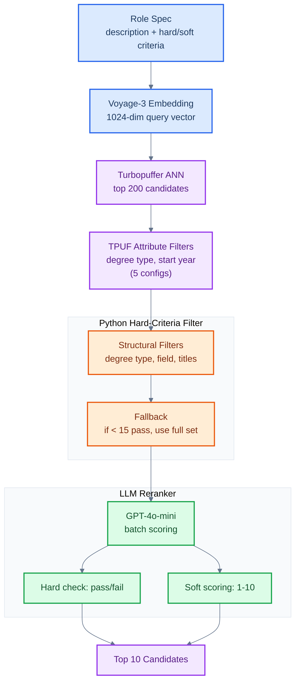

# Candidate Search Pipeline


Three-stage retrieval pipeline for matching candidates to role specifications: vector retrieval, hard-criteria filtering, and LLM reranking. Given ~200K LinkedIn profiles in a Turbopuffer vector DB (embedded with voyage-3), returns the 10 best-fit candidates for each of 10 role configs. Each config has hard criteria (must-have) and soft criteria (nice-to-have), scored by an evaluation endpoint on hard pass rate and soft relevance (0-10).

## The Problem

You have a vector database of candidate profiles and a role spec with both hard requirements (JD degree, 3+ years experience) and soft preferences (IRS audit exposure, legal writing). Embedding similarity alone conflates these, returning candidates who are semantically close but missing hard requirements entirely.

## What This Does

1. **Vector retrieval**: Embed a rich query (description + hard + soft criteria) with Voyage-3, retrieve top 200 from Turbopuffer via ANN search. For 5 configs, TPUF attribute filters (degree type, start year) narrow results at query time
2. **Hard-criteria filtering**: Python-level regex filters on degree type, field of study, and experience titles. Intentionally relaxed to preserve recall, with a fallback to the full candidate set if fewer than 15 pass
3. **LLM reranking**: GPT-4o-mini scores each candidate on hard + soft criteria. Hard failures get score 0. Remaining candidates scored 1-10 on soft criteria fit

## Architecture



## Quick Start

**Prerequisites**: Python 3.9+, API keys for OpenAI, Voyage AI, and Turbopuffer.

```bash
python -m venv venv && source venv/bin/activate
pip install -r requirements.txt

export OPENAI_API_KEY="sk-..."
export VOYAGE_API_KEY="pa-..."
export TPUF_API_KEY="tpuf_..."

python main.py                              # Run all 10 configs
python main.py --config tax_lawyer.yml      # Run single config
python main.py --no-submit                  # Run without submitting to eval endpoint
```

## Results

### Run 1: Vector + strict filter + soft-only LLM rerank (46.7 avg)

| Config | Score | Hard Pass Rates |
|---|---|---|
| Tax Lawyer | 82.7 | 100%, 100% |
| Junior Corporate Lawyer | 82.7 | 100%, 90% |
| Mechanical Engineers | 81.7 | 100%, 90% |
| Bankers | 73.7 | 90%, 90% |
| Radiology | 71.3 | 90% |
| Quantitative Finance | 43.0 | 90%, 50% |
| Biology Expert | 32.0 | 50%, 70% |
| Anthropology | 0.0 | 100%, 0% |
| Doctors (MD) | 0.0 | 0%, 90%, 100% |
| Mathematics PhD | 0.0 | 0%, 40% |

### Why the 0s

The eval endpoint uses an LLM judge for hard criteria, catching nuances that structured filters miss:

- **Anthropology (0.0):** 100% on "has PhD" but 0% on "PhD started within last 3 years." My filter had no recency check. The vector retrieval found anthropology PhDs, but none were recent enough.
- **Doctors MD (0.0):** 0% on "MD from top U.S. medical school." The deg_degrees field contains "MD" but no signal for school prestige ranking. Vector search returned MDs from non-US or non-top-tier schools.
- **Mathematics PhD (0.0):** 0% on "undergrad from US/UK/Canada." The hard criterion was about undergrad location, not PhD. My filter only checked degree type and field, not school geography.

### Root cause

Structured filters can enforce "has JD" or "field contains biology" but cannot evaluate "top U.S. medical school" or "PhD started recently." These require judgment, which is what the LLM reranker should handle.

### Run 2: Relaxed filters + LLM hard+soft rerank

Changes made:
1. **Richer query embedding:** Concatenated description + hard criteria + soft criteria before embedding, so vector retrieval pulls candidates matching the full intent, not just the role description.
2. **Relaxed hard filters:** Loosened degree matching (substring instead of exact), removed experience-year bucket checks. Filters now only remove obvious mismatches.
3. **LLM judges hard criteria:** Reranker prompt now includes hard criteria explicitly. Candidates failing any hard criterion get score 0. Candidates passing all hard criteria scored 1-10 on soft fit.
4. **Structured data in LLM prompt:** Passed degrees, experience, country, and summary to the LLM so it can evaluate criteria like school prestige and recency.

| Config | Avg Score |
|---|---|
| Mechanical Engineers | 92.7 |
| Bankers | 81.3 |
| Tax Lawyer | 80.0 |
| Junior Corporate Lawyer | 74.3 |
| Radiology | 71.0 |
| Mathematics PhD | 42.5 |
| Biology Expert | 37.7 |
| Quantitative Finance | 34.0 |
| Doctors (MD) | 8.0 |
| Anthropology | 0.0 |

Run 2 improved overall average from 46.7 to 52.1. Configs with clear structural signals (engineering degrees, JD + bar) perform best. Configs requiring nuanced recency or subfield matching (anthropology, quantitative finance) remain difficult because the LLM reranker operates on truncated summaries and cannot fully evaluate temporal or prestige-based criteria.

## Key Decisions

- **voyage-3 for query embedding.** Matches the corpus embedding model, ensuring vector space alignment.
- **Vector retrieval before filtering.** Narrowing 200K to 200 via ANN is milliseconds. Filtering 200 in memory is instant. Reversing the order risks either too-broad or too-narrow filter results.
- **GPT-4o-mini over GPT-4o.** 10x cheaper, sufficient accuracy for 0-10 relevance scoring.
- **Relaxed filters + strict LLM.** Better to let borderline candidates through to the LLM than to filter them out with brittle string matching.
- **Fallback to full set.** If filters return fewer than 15 candidates, skip filtering and let the LLM sort everything.
- **Batched LLM reranking.** Candidates scored in batches of 5 to stay within context limits while providing enough comparison context for relative scoring.

## What I Would Do With More Time

1. **Reciprocal Rank Fusion:** Combine vector ANN and BM25 results before filtering for better recall on exact keywords.
2. **Voyage cross-encoder reranking:** Faster intermediate rerank between filters and LLM scoring.
3. **Query expansion:** LLM-generated variant phrasings for multi-vector retrieval.
4. **Increase top_k to 500:** Wider net for configs where the target population is small.
5. **Generic filter-free pipeline:** Drop per-config filters and rely on enriched query embedding + LLM reranking for unseen role types.

## Project Structure

```
mercor-search/
├── main.py              # Entry point: run all/single configs, submit results
├── pipeline.py          # 3-stage orchestration: embed, filter, rerank
├── embed.py             # Voyage-3 query embedding
├── tpuf_client.py       # Turbopuffer vector search client
├── filters.py           # Per-config hard-criteria filters
├── rerank.py            # GPT-4o-mini batch reranking
├── evaluate.py          # Mercor eval endpoint submission
├── configs/
│   └── queries.json     # 10 role configurations
├── results/             # Per-config evaluation results
└── requirements.txt
```

## License

MIT
